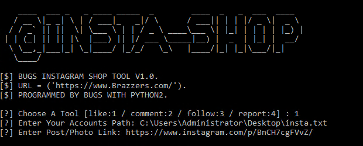

# InstagramShop

Instagram Toolkit For Auto [Like/Com/Follow/Report] With Emails.

```
>>> ================================================================ <<<
>>>    ____  ___ _   _ ____ _____  _        ____  _   _  ___  ____   <<<
>>>   / __ \|_ _| \ | / ___|_   _|/ \      / ___|| | | |/ _ \|  _ \  <<<
>>>  / / _` || ||  \| \___ \ | | / _ \ ____\___ \| |_| | | | | |_) | <<<
>>> | | (_| || || |\  |___) || |/ ___ \_____|__) |  _  | |_| |  __/  <<<
>>>  \ \__,_|___|_| \_|____/ |_/_/   \_\   |____/|_| |_|\___/|_|     <<<
>>>   \____/                                                         <<<
>>> ================================================================ <<<
>>> [DEV] : SIRBUGS (Fares Walid)                                    <<<
>>> [GitHub] : https://www.github.com/sirbugs                        <<<
>>> [Version] : 1.0.V                                                <<<
>>> ++++++++++++++++++++++++++++++++++++++++++++++++++++++++++++++++ <<<
```

```bash
$ pip install requests
```
```bash
$ python Insta.py
```



# How to use
- Requirements
  - Fast internet connection
  - Path list [user:Pass]
  - requests module

